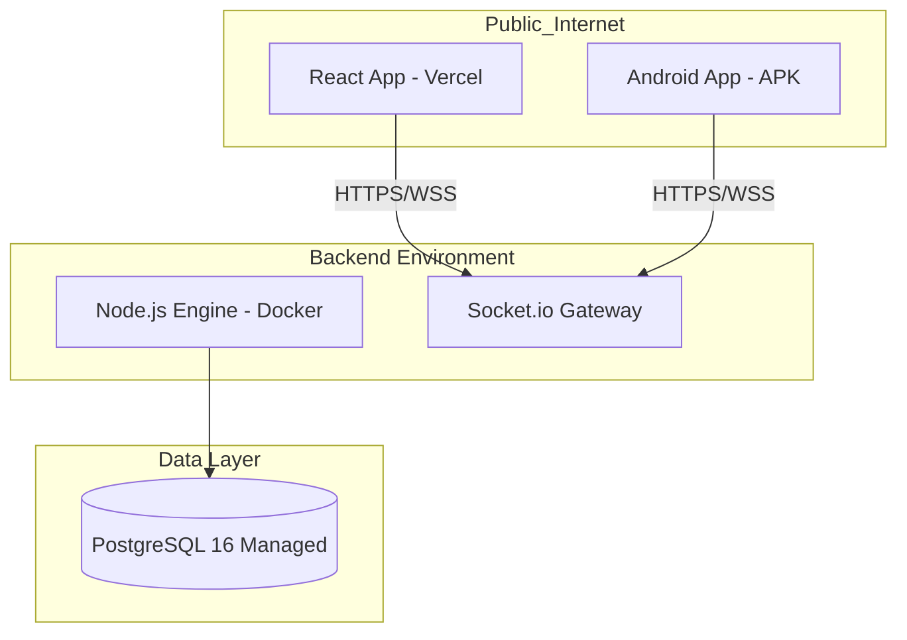

# Topología de Despliegue

BombaVa utiliza una arquitectura de nube híbrida diseñada para la alta disponibilidad y la latencia mínima en WebSockets.

## Esquema de Infraestructura

## Estrategia de Contenedores

El sistema es **Container-Agnostic**. El `Dockerfile` se encarga de:

1.  Instalar dependencias nativas para `bcrypt`.
2.  Exponer el puerto 3000.
3.  Ejecutar el proceso como usuario no-root (`node`) para cumplir estándares de seguridad de producción.

## Persistencia de Datos (Neon)

Se utiliza Neon por su capacidad de **Branching de Base de Datos**, permitiendo que el equipo de integración cree réplicas exactas de producción para probar migraciones de barcos o armas sin riesgo de pérdida de datos de usuarios reales.
