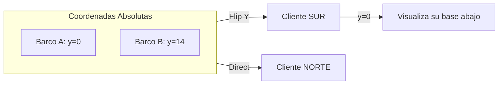

# Protocolo de Red y Sincronización

BombaVa emplea una arquitectura de red asimétrica basada en **State Snapshots**. El servidor procesa la lógica global y emite visiones personalizadas a cada cliente.

## Simetría y Traducción de Coordenadas

El tablero es un grid de 15x15. Para facilitar el desarrollo del Frontend, cada jugador siempre visualiza su base en la parte inferior de la pantalla. Esto requiere una **Traducción de Perspectiva** en el Backend.

*   **Bando NORTH**: Utiliza coordenadas absolutas \( (x, y) \).
*   **Bando SOUTH**: El servidor invierte el eje Y antes de enviar el paquete de datos.
    *   \( y_{client} = (MAP\_SIZE - 1) - y_{absolute} \)
    *   \( orientacion_{client} = opuesta(orientacion_{absolute}) \)

## Mecánica de Niebla de Guerra (Fog of War)

El servidor es el único que posee el `FullState`. El proceso de filtrado sigue estos pasos:

1.  **Cálculo de Visión**: Se determina el radio de visión de cada `ShipInstance` viva del Jugador A.
2.  **Filtrado de Entidades**: Cualquier `ShipInstance` del Jugador B cuyas coordenadas no estén dentro de ningún radio de visión del Jugador A son eliminadas del payload.
3.  **Emisión Privada**: Se envía el evento `match:vision_update` de forma individual (no a la sala global).

## Eventos de Intención (WebSockets)

A diferencia de los juegos basados en frames, BombaVa utiliza **Eventos de Intención**. El cliente no mueve el objeto; solicita permiso al servidor mediante `ship:move`. Si el servidor valida el movimiento (recursos suficientes y colisión nula), devuelve la confirmación y el nuevo estado de los recursos.
