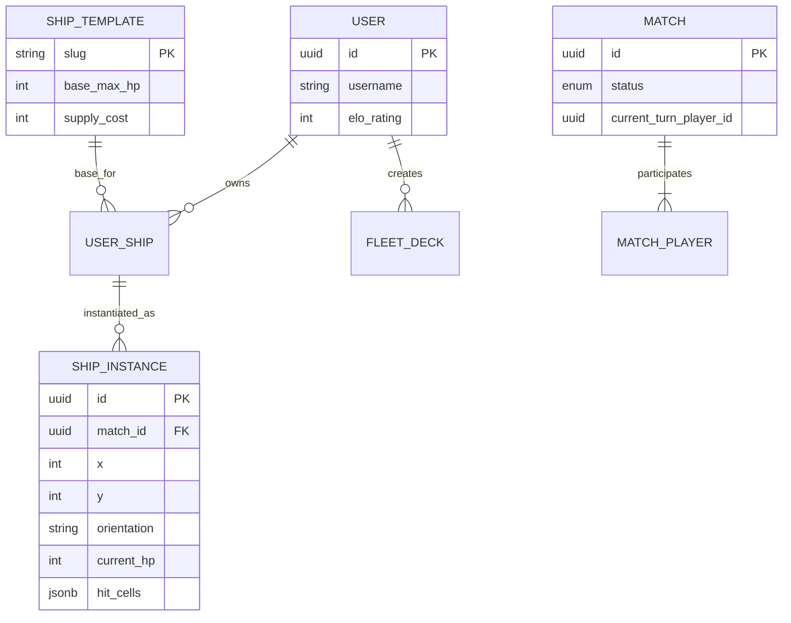

# Modelo de Persistencia y Datos

El sistema utiliza **PostgreSQL** gestionado a través de **Sequelize ORM**. El diseño garantiza la integridad referencial y la flexibilidad mediante campos JSONB.

## Diagrama Entidad-Relación (E-R)

## Diccionario de Datos: Entidades Críticas

### Tabla: `ship_instances` (Motor de Combate)
Es la tabla con mayor frecuencia de escritura. Representa el estado físico en el grid.

| Campo | Tipo | Restricción | Descripción |
| :--- | :--- | :--- | :--- |
| `id` | UUID | PK, Default V4 | Identificador único de la instancia. |
| `match_id` | UUID | FK -> `matches` | Partida a la que pertenece. |
| `x`, `y` | Integer | [0 - 14] | Coordenadas absolutas en el mapa. |
| `orientation` | ENUM | {N, S, E, W} | Dirección hacia la que apunta la proa. |
| `current_hp` | Integer | >= 0 | Salud actual. Si es 0, `is_sunk` cambia a true. |
| `hit_cells` | JSONB | Not Null | Registro de daño localizado por índice de celda. |

### Tabla: `match_players` (Estado del Jugador)
Gestiona la economía interna de la partida.

| Campo | Tipo | Restricción | Descripción |
| :--- | :--- | :--- | :--- |
| `fuel_reserve` | Integer | [0 - 30] | Puntos de movimiento disponibles. |
| `ammo_current` | Integer | [0 - 5] | Puntos de acción para este turno. |
| `side` | ENUM | {NORTH, SOUTH} | Define la traducción de perspectiva. |

## Integridad de Sesión
Cuando se inicia una partida, el sistema guarda una copia del `FLEET_DECK` activo en la tabla `MATCH_PLAYER` (`deck_snapshot`). Esto asegura que, aunque el usuario modifique su flota en el Puerto durante la partida, el estado de la batalla actual permanezca inalterado (Consistencia de Sesión).
