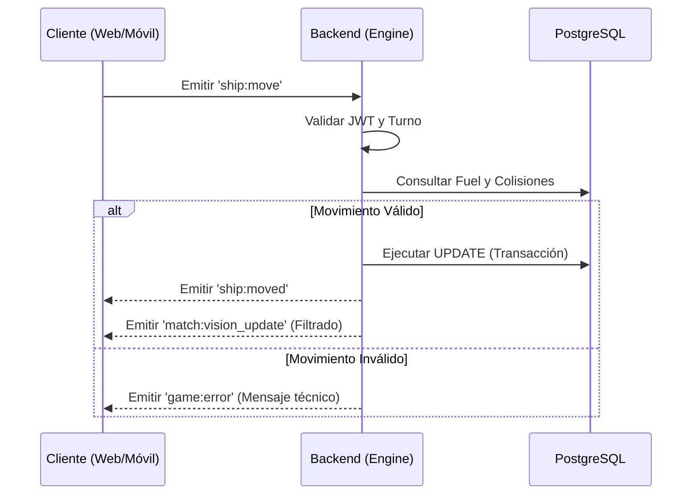

# Integración de Sistemas: Trazabilidad de una Intención

Este documento detalla el ciclo de vida completo de una acción táctica, desde la interfaz de usuario hasta la persistencia en disco.

## Ejemplo: Acción de Movimiento (ship:move)

### Fase 1: Emisión en el Cliente (Frontend)

El usuario pulsa la flecha "Adelante" en `ActionButtons.jsx` (Web) o `PantallaJuego.java` (Móvil).

*   Se valida que `esMiTurno == true`.
*   Se emite el evento `ship:move` con el `shipId` y la `direction` (N, S, E, W).

### Fase 2: Recepción y Validación (Backend)

El `socketMiddleware.js` intercepta la señal y valida el JWT. Si es correcto, el `movement.js` (Módulo Engine) procesa la solicitud:

1.  **Consultar Contexto**: El `MatchDao` recupera el estado de la partida y el `MatchPlayer`.
2.  **Validar Recursos**: Se comprueba si `fuel_reserve >= COST_MOVE`.
3.  **Simular Movimiento**: El `EngineService` calcula la nueva posición y verifica colisiones contra otros barcos u obstáculos.

### Fase 3: Persistencia Transaccional (Database)

Si la validación es positiva, se inicia una transacción SQL:

*   `UPDATE ship_instances SET x = newX, y = newY WHERE id = shipId`.
*   `UPDATE match_players SET fuel_reserve = fuel_reserve - 1 WHERE userId = currentUserId`.

### Fase 4: Notificación Asimétrica (Red)

El servidor no responde con un "OK", sino que emite una actualización de estado:

1.  Informa a la sala: `ship:moved`.
2.  Recalcula la **Niebla de Guerra** para ambos jugadores.
3.  Emite `match:vision_update` individualmente con los datos filtrados.

