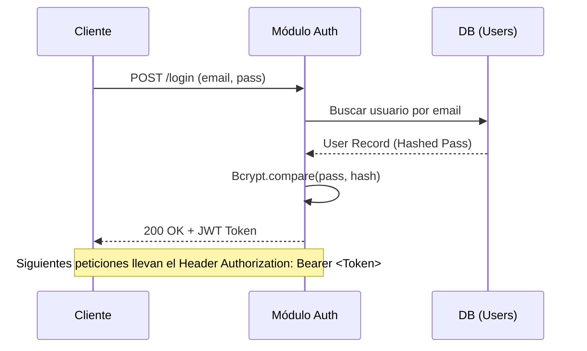

# Módulo Auth: Seguridad y Progresión

Este módulo gestiona la identidad de los usuarios y su posición en la jerarquía competitiva del sistema.

## 1. Flujo de Autenticación (JWT)

BombaVa utiliza **JSON Web Tokens** firmados para mantener sesiones sin estado (stateless). 

## 2. El Sistema de Ranking (Fórmula ELO)

Tras cada partida marcada como `FINISHED`, el `UserService` calcula la variación de puntuación de ambos jugadores. Se utiliza una adaptación del sistema Arpad Elo:

\[ R_a' = R_a + K \cdot (S_a - E_a) \]

Donde:

*   **\(R_a\)**: ELO actual.
*   **\(K\)**: Factor de desarrollo (fijado en 32).
*   **\(S_a\)**: Resultado de la partida (1 para victoria, 0 para derrota).
*   **\(E_a\)**: Puntuación esperada, calculada como: \( E_a = \frac{1}{1 + 10^{(R_b - R_a)/400}} \).

## 3. Seguridad en Capas (Middleware)

Todas las solicitudes sensibles pasan por `src/shared/middlewares/authMiddleware.js`. Este componente:

1.  Extrae el token del Header.
2.  Verifica la integridad con la clave secreta del entorno.
3.  Inyecta el objeto `user` en el objeto `req` de Express o `socket.data` de Socket.io.
