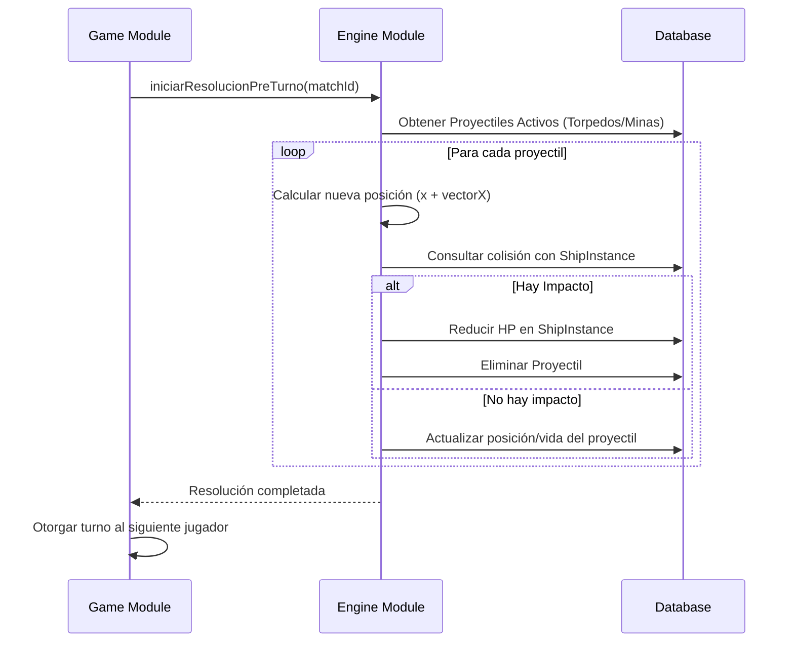

# Módulo Engine: El Motor Táctico

El módulo `engine` es el responsable de computar la física del juego, la detección de colisiones y la aplicación de daño localizado.

## Concepto de Instancia frente a Plantilla

Para preservar la progresión del usuario, el sistema distingue entre dos tipos de entidades:

1.  **UserShip (Inventory)**: Representa la propiedad permanente del jugador (nivel, armas equipadas).
2.  **ShipInstance (Engine)**: Una copia volátil creada al inicio de una partida. Contiene coordenadas `(x, y)`, `currentHp` y el estado de sus celdas de impacto.

## Ciclo de Vida de un Turno (Resolución Táctica)

Antes de que un jugador reciba el control (Puntos de Acción/Movimiento), el Engine procesa el estado del mundo de forma asíncrona.

## Mecánicas de Combate Implementadas

### 1. Cañón (Ataque Instantáneo)

*   **Validación**: El servidor comprueba si el `target` está dentro del radio definido en `WeaponTemplate` respecto a la posición de la `ShipInstance`.
*   **Resolución**: El daño se aplica inmediatamente. No genera entidad en la tabla `Projectiles`.

### 2. Torpedo (Proyectil Dinámico)

*   **Lanzamiento**: Se crea un registro en `Projectiles`.
*   **Persistencia**: Tiene un `lifeDistance`. Se mueve una casilla en cada cambio de turno hasta impactar o agotarse.

### 3. Daño Localizado (Hit Cells)

El campo `hit_cells` (JSONB) en la base de datos rastrea qué partes específicas del barco han sido golpeadas. Esto permite que el sistema aplique penalizaciones:

*   **Impacto en Motor**: Reduce los puntos de movimiento (MP) generados por turno.
*   **Impacto en Puente**: Reduce el radio de visión (Niebla de Guerra).
