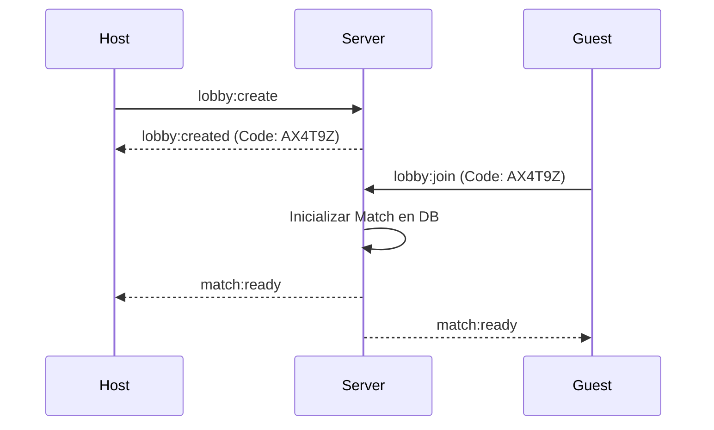

# Módulo Game: Lobbies y Turnos

Este módulo orquesta la interacción entre jugadores y gestiona el ciclo de vida de la partida (`Match`).

## Estados de una Partida

Una partida transita por los siguientes estados definidos en el modelo `Match`:

1.  **WAITING**: Sala creada, esperando al segundo jugador.
2.  **PLAYING**: Partida en curso, motor de turnos activo.
3.  **FINISHED**: Condiciones de victoria cumplidas, ELO actualizado.

## Lógica de Matchmaking (Lobbies)

El sistema utiliza códigos alfanuméricos de 6 dígitos para la creación de salas privadas.

## Motor de Turnos y Recursos

Al inicio de cada turno, el `StatusService` ejecuta las siguientes acciones:

1.  **Regeneración de Combustible (MP)**: Se añade una cantidad fija (definida en `GameRules`) al `fuel_reserve` del jugador activo, con un tope máximo.
2.  **Reset de Munición (AP)**: Los puntos de acción se reinician al valor máximo (no son acumulables).
3.  **Resolución de Proyectiles**: Se delega en el [Módulo Engine](./engine.md) el movimiento de proyectiles enemigos disparados en turnos anteriores.

## Finalización y Ranking

Al detectar que una flota ha sido completamente hundida (`is_sunk`), el módulo solicita al `AuthService` el cálculo de la variación de **ELO** basándose en la probabilidad de victoria de ambos jugadores antes del encuentro.
