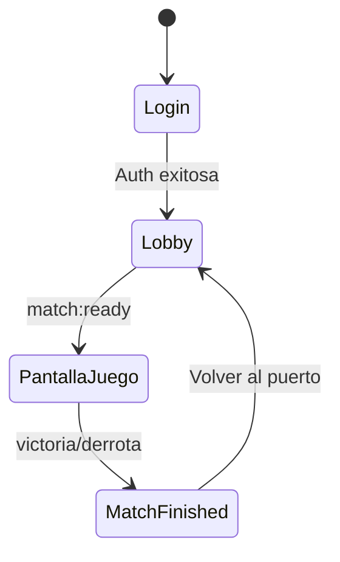

# Arquitectura Frontend Móvil (Android)

El cliente móvil está desarrollado en **Java Nativo** para asegurar el máximo rendimiento en la gestión de WebSockets y la renderización del grid de batalla.

## 1. Capa de Red y Comunicación

El sistema móvil utiliza dos librerías especializadas:

*   **Retrofit 2**: Para el consumo de la [API REST](../api/rest.md). Gestiona la serialización GSON y los interceptores de seguridad para el Bearer Token.
*   **Socket.io Client Java**: Mantiene la conexión persistente para el motor de juego.

## 2. Gestión de Sincronización en Segundo Plano

Dado que las actualizaciones de socket ocurren fuera del hilo principal de UI, el `GestorJuego.java` utiliza el método `runOnUiThread()` para asegurar que los cambios en la flota o los recursos no bloqueen la aplicación ni causen excepciones de concurrencia.

## 3. Adaptación del Tablero (RecyclerView)

El mapa de 15x15 se implementa mediante un `GridLayoutManager`. Cada `Casilla.java` es un objeto de modelo que reacciona a los cambios del `BoardAdapter`.

### El Puente de Red (Localhost IP)

Para el desarrollo en emuladores, el sistema implementa una lógica de detección automática:

*   **Producción**: Conecta a la URL de Render.
*   **Desarrollo**: Utiliza la IP puente del emulador para acceder al localhost de la máquina host.

## 4. Ciclo de Vida de la Partida

