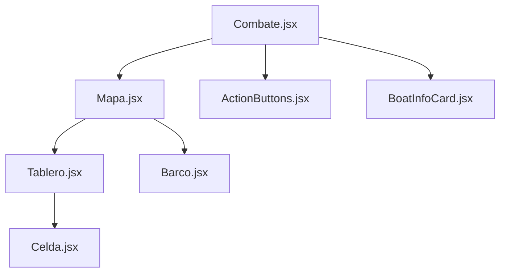

# Arquitectura Frontend Web

La aplicación web está construida sobre **React 19** utilizando **Vite** como orquestador de build. El diseño técnico prioriza la reactividad y la sincronización constante con el estado del servidor.

## 1. Gestión de Estado y Sockets

A diferencia de aplicaciones CRUD tradicionales, BombaVa-Web mantiene una instancia persistente de Socket.io en `src/utils/socket.js`. Esto permite que cualquier componente se suscriba a eventos globales sin re-conectar.

### Flujo de Sincronización de Partida

Cuando el componente `Combate.jsx` se monta:

1.  Recupera el `matchId` del almacenamiento local.
2.  Emite `game:join` al Backend.
3.  Registra listeners para `match:vision_update` y `match:turn_changed`.
4.  Al recibir datos, actualiza el estado local mediante el hook `useMovimientosBarco`.

## 2. Jerarquía de Componentes de Juego

## 3. Traducción Visual (Coordenadas)

El Frontend Web asume que la coordenada `(0,0)` es la esquina superior izquierda. Sin embargo, para mantener la consistencia con el [Protocolo de Networking](../architecture/networking.md), el cliente aplica una función de utilidad `traducirCoordY()` antes de enviar cualquier ataque o movimiento, asegurando que el Backend reciba coordenadas absolutas.

## 4. Renderizado de Unidades

Los barcos se renderizan de forma absoluta sobre el contenedor del mapa. Su posición se calcula porcentualmente:

\( Posición \% = (Coordenada / TamañoTablero) \cdot 100 \)

Esto garantiza que el tablero sea totalmente **Responsive** sin perder precisión táctica.
