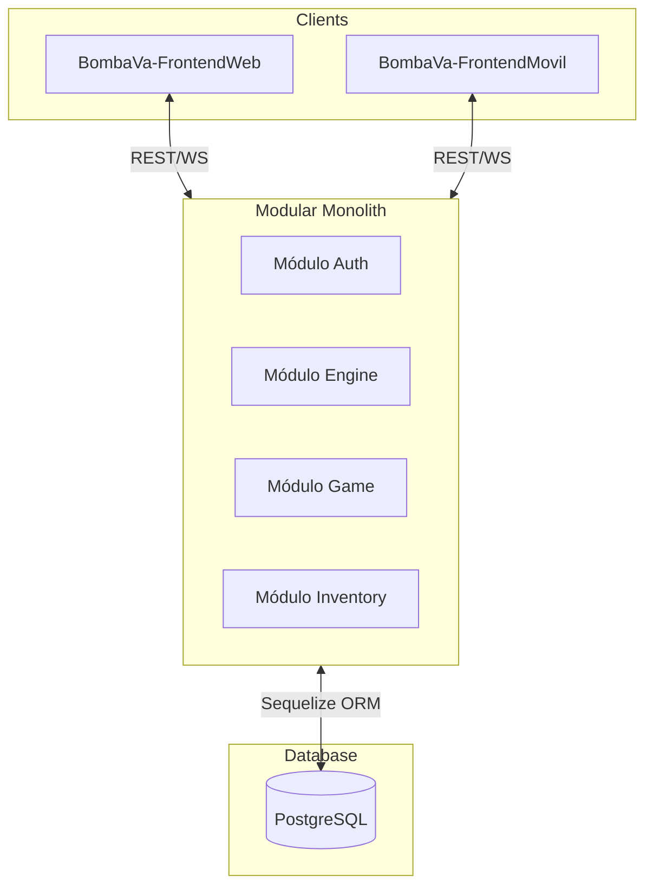

# Introducción al Proyecto BombaVa

BombaVa es un ecosistema de juego táctico naval multijugador por turnos, diseñado bajo una arquitectura de **Monolito Modular**. El sistema garantiza la integridad de las partidas mediante un modelo de **Autoridad Total del Servidor**, donde los clientes (Web y Móvil) actúan únicamente como terminales de visualización y envío de intenciones.

## Objetivos del Diseño Técnico

1.  **Integridad Táctica**: Toda validación de reglas, desde el rango de un cañón hasta el consumo de combustible, ocurre exclusivamente en el Backend.
2.  **Consistencia de Estado**: El uso de WebSockets (Socket.io) asegura que ambos jugadores visualicen el mismo estado del tablero con una latencia mínima.
3.  **Persistencia Transaccional**: Las operaciones críticas se ejecutan mediante transacciones SQL para evitar estados corruptos ante desconexiones.

## Mapa de Componentes

## Glosario Técnico

*   **AP (Action Points)**: Puntos de acción usados para disparar armas. Se resetean cada turno.
*   **MP (Movement Points)**: Puntos de movimiento (Combustible). Son acumulables turno tras turno.
*   **Slug**: Identificador único en formato texto (ej. `cannon-base`) usado para buscar plantillas en la DB.
*   **Fachada (Facade)**: Archivo `index.js` que actúa como interfaz única para un módulo, ocultando su implementación interna.
*   **Bootstrap**: Proceso de carga inicial de datos maestros (barcos y armas base) sin los cuales el sistema no puede funcionar.
*   **Seeder**: Proceso de generación de datos de prueba (usuarios, mazos) para agilizar el desarrollo.
